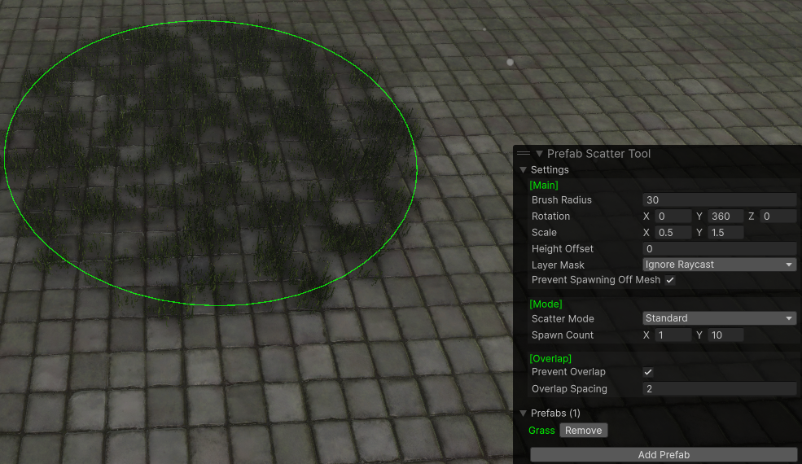

# Prefab Scatter Tool (Unity)
Paint/scatter prefabs across the surface of a collider with a wide variety of options/randomizations. Label tooltips contain more information for each option.



## Installation
### Using Unity Package Manager
In Unity, open the Package Manager. Click the '+' icon in the top left, select 'Install package from Git URL' and enter the following:
```
https://github.com/Aelstraz/PrefabScatterTool.git
```

### Manually
Download this git repository and move the folder into your project.

## Usage
Select a GameObject in your scene with a Collider component, then select the Prefab Scatter Tool from the Toolbar in the scene view. This will open an overlay containing the user interface.
